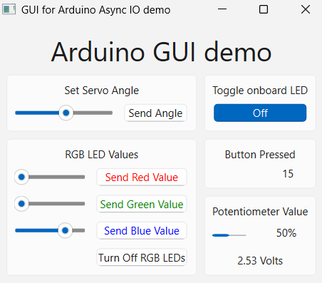

# AsyncIOdemo

A demo showcasing interaction between an Arduino and a PC via a USB serial port, demonstrating skills in Python GUI development, serial communication, and multithreading. The GUI, built with PySide6, controls an Arduino to:

- Set a servo angle (0–180° via slider).
- Adjust brightness of three separate red, green, and blue LEDs or turn them off.
- Toggle the Arduino’s onboard LED.
- Display a tally of tactile button presses.
- Show potentiometer level (via progress bar) and voltage (0–5V).

## Skills Demonstrated
- **Python and PySide6**: Developed a user-friendly GUI with Qt widgets and layouts.
- **Serial Communication**: Implemented asynchronous `QSerialPort` communication with a custom message protocol.
- **Multithreading**: Used `QThread` and signals/slots for thread-safe, non-blocking GUI updates.
- **Arduino Integration**: Designed robust Arduino-PC interaction with state retention (e.g., button counts).

## Hardware Requirements
- Arduino board (e.g., Uno, tested on Uno).
- Servo motor.
- Three separate red, green, and blue LEDs.
- Tactile button switch.
- 10kΩ potentiometer.
- 10kΩ resistor (for button).
- Three 1kΩ resistors (for LEDs).
- Breadboard and jumper wires.
- External 5V power supply for the servo.

## Software Requirements
- Arduino IDE 2.x. (Tested under v2.3.6.)
- Python 3.8+. (Tested under v3.11.4.)
- PySide6 (`pip install pyside6`). (Tested under v6.9.0.)
- GNU sed (included with Git Bash or MSYS2 on Windows) for generating `comms.py`.

## Setup
1. **Arduino**:
    - Clone or download this repository.
    - Open `AsyncIOdemo.ino` in Arduino IDE.
    - Connect your Arduino via USB.
    - Upload the sketch to the Arduino.
1. **Python GUI**:
    - Install Python 3.8+.
    - Install PySide6: `pip install pyside6`.
    - Note: The GUI uses `COM4` by default (defined in `PythonGUI/commsIO.py`). Update the port if your Arduino uses a different COM port (check in Arduino IDE under Tools > Port).
1. **Usage**:
    - Ensure Arduino is connected to `COM4`.
    - Run `AsyncIOdemoGUI.cmd` to generate `PythonGUI/comms.py` from `comms.h` and launch the GUI.
    - Use the slider to set servo angles, buttons to toggle the onboard LED, and sliders/buttons to control LEDs.
    - View button press counts and potentiometer data in real time.

## Circuit Setup
See the circuit photo in .

This demo requires a breadboard circuit connecting an Arduino to a servo, a 10kΩ potentiometer, a tactile button, and three separate LEDs (red, green, and blue). For pin assignments, refer to the `Breadboard.h` header file (e.g., `SERVO`, `TACTILE`, `POTENTIOMETER`).

- **Power Supply**:
    - An external 5V power supply is required for the servo to ensure sufficient current.
    - Connect the power supply’s GND to the Arduino’s GND to establish a common ground.

- **Servo**:
    - Connect the servo’s power pin to the external 5V supply, its ground pin to the shared GND, and its signal pin to the Arduino pin defined as `SERVO`.

- **10kΩ Potentiometer**:
    - Connect one outer pin to 5V (from the Arduino), the other to GND, and the wiper (middle pin) to the Arduino pin defined as `POTENTIOMETER`.

- **LEDs (Red, Green, Blue)**:
    - For each LED:
      - Connect the cathode (short pin) to GND via a 1kΩ resistor.
      - Connect the anode (long pin) to the Arduino pin defined as `redLED`, `greenLED`, or `blueLED`, which provides power via digital output.

- **Tactile Button**:
    - The button has two pairs of internally connected pins.
    - Connect one pair to 5V (from the Arduino).
    - Connect the second pair to the Arduino pin defined as `TACTILE` and to GND via a 10kΩ resistor. The Arduino sketch uses `INPUT_PULLUP`, which may conflict with the external resistor, but this setup functions for the demo.

**Note**: All components must share a common GND. The button wiring (external resistor with `INPUT_PULLUP`) may not be optimal but is functional, as adapted from the reference tutorial. Use a single 5V source (Arduino or external supply) for non-servo components to avoid conflicts.

## Screenshot

## Potential Future Improvements
- Send a message on startup to request the Arduino’s current potentiometer value and button count.
- Add a `QTimer` in `CommsWorker` to detect communication failures (e.g., no messages for X seconds).
- Implement Python’s `logging` module to track messages and errors.
- Port the GUI to C++ Qt to eliminate the Batch script translation.
    - Alternatively, create a Python script to replace `sed`.
- Add a UI combo box to select the serial port and baud rate via `QSerialPortInfo`.
- Support automatic reconnection if the Arduino is unplugged/replugged.
- Add a `QLabel` to `ServoWidget` to show the selected angle.
- Deepen understanding of circuit design (e.g., button wiring) to replace trial-and-error with best practices.

## Notes
- This project was inspired by the [Arduino GUI Using C#](https://www.youtube.com/playlist?list=PLDxm-EGn62t7indrQcJGBchHJCJqTWdGP) playlist on the Byte Me YouTube channel, adapted to Python with PySide6 and enhanced with a robust message protocol.
- The Arduino retains state (e.g., button counts) across GUI restarts, showcasing reliable serial communication.
- `comms.py` is generated by `AsyncIOdemoGUI.cmd` and ignored by `.gitignore`.
- The button wiring may not be optimal due to the external resistor with `INPUT_PULLUP`, but it functions for the demo, as adapted from the reference tutorial.
- This project was refactored with assistance from Grok, an AI tool by xAI, which provided guidance on debugging serial communication, optimizing threading, and refining documentation. The core design, implementation, and circuit setup were developed by the author.

## Contributing
Submit issues or pull requests with improvements, especially for GUI or documentation enhancements.

## License
This project is licensed under the GNU General Public License v3.0 (GPL-3.0) due to PySide6. See [LICENSE](LICENSE) for details.
