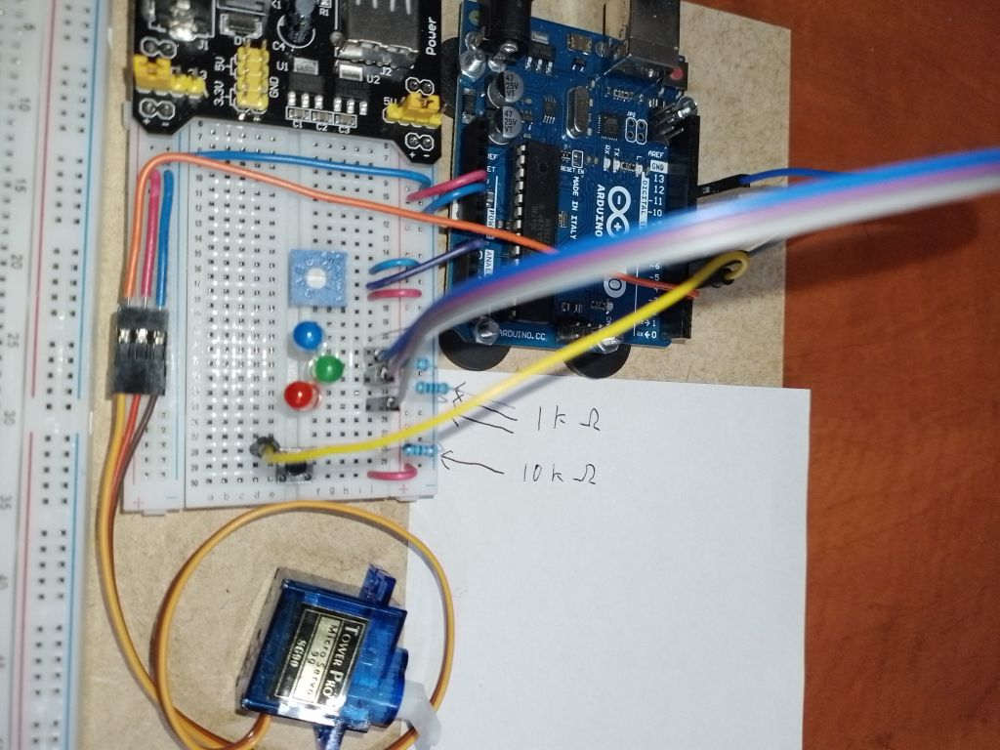

# AsyncIOdemo
A demo showcasing interaction between an Arduino and a PC via a COM port (e.g., USB cable). The Python GUI, built with PySide6, controls an Arduino to:

- Set a servo angle.
- Adjust brightness of red, green, and blue LEDs or turn them off.
- Toggle the Arduino’s onboard LED.
- Display a tally of tactile button presses.
- Show potentiometer level and voltage.

## Features
- Asynchronous serial communication for real-time Arduino-PC interaction.
- User-friendly GUI to control Arduino and visualize data.
- Custom wiring setup with a detailed diagram.

## Hardware Requirements
- Arduino board (e.g., Uno, tested on Uno).
- Servo motor.
- Red, green, and blue LEDs.
- Tactile button switch.
- Potentiometer.
- 10 kΩ resistor (for button).
- Three 1kΩ resistors (for LEDs).
- Breadboard and jumper wires.
- See the **Wiring** section for the wiring diagram.

## Software Requirements
- Arduino IDE 2.x.
- Python 3.8+.
- PySide6 (`pip install pyside6`).
- pyserial (`pip install pyserial`) for serial communication.
- GNU sed (included with Git Bash or MSYS2 on Windows) for generating `comms.py`.
- Python is run through a script on the system path.

## Setup
1. **Arduino**:
    - Clone or download this repository.
    - Open `AsyncIOdemo.ino` in Arduino IDE.
    - Connect your Arduino via USB.
    - Upload the sketch to the Arduino.
1. **Python GUI**:
    - Install Python 3.8+.
    - Install dependencies: `pip install -r requirements.txt`.
    - Run `AsyncIOdemoGUI.cmd` to generate `comms.py` from `comms.h` and launch the GUI.
    - Note: The GUI uses COM6 by default (defined in `commsIO.py`). Update the port in `commsIO.py` if your Arduino uses a different COM port (check in Arduino IDE under Tools > Port).
1. **Usage**:
    - Ensure Arduino is connected via USB to COM6 (update `commsIO.py` if needed).
    - Run `AsyncIOdemoGUI.cmd` to generate `comms.py` and launch the GUI.
    - Alternatively, if `comms.py` is already generated, launch the GUI directly with `python AsyncIOdemoGUI.py`.
    - Use sliders/buttons to control the servo, LEDs, and onboard LED.
    - View button press tally and potentiometer data in the GUI.

## Wiring
The wiring diagram is in . Key notes:

- **Tactile Button**:
    - Given that the pins are paired (A1-A2, B1-B2),
    - Connect A1 to 5V, B1 to GND via a 10 kΩ resistor, B2 to Arduino pin 4.
- Other components (servo, LEDs, potentiometer) follow the wiring diagram.
- `Breadboard.h` defines pin assignments for reference.

## Inspiration
This project was inspired by the [Arduino GUI Using C#](https://www.youtube.com/playlist?list=PLDxm-EGn62t7indrQcJGBchHJCJqTWdGP) playlist on the Byte Me YouTube channel. It was adapted to use Python with PySide6 instead of C#.

## Additional Resources
- [Serial Input Basics](https://forum.arduino.cc/t/serial-input-basics-updated/382007) (Arduino forum).
- [Monitoring COM port in the background](https://www.youtube.com/watch?v=HKgk4i8u8nk) (YouTube).
- [Ending a Thread](https://stackoverflow.com/questions/323972/is-there-any-way-to-kill-a-thread) (Stack Overflow).

## Notes
- The GUI could be improved with QGroupBox for better layout (as in the original C# version). Contributions welcome!
- `comms.py` is generated by `AsyncIOdemoGUI.cmd` and ignored by `.gitignore`.
- Much, if not all, of `MyWidget.commsMonitorThread` in `AsyncIOdemoGUI.py` should be moved into `commsIO.py.recvWithStartEndMarkers` for better code organization, but this requires learning Qt signalling, which I didn’t explore at the time.

## Contributing
Feel free to submit issues or pull requests with improvements, especially for GUI enhancements or documentation.

## License
This project is licensed under the GNU General Public License v3.0 (GPL-3.0) due to its use of PySide6. See [LICENSE](LICENSE) for details.